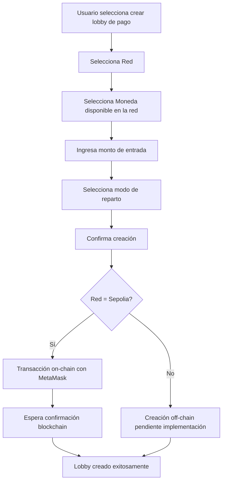
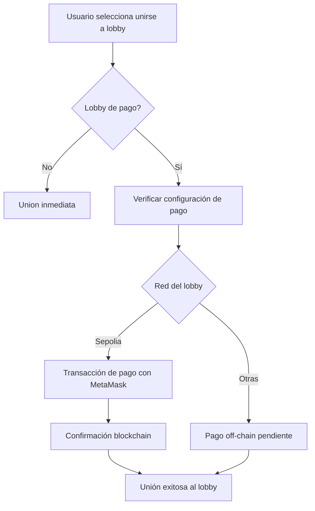

# Sistema de Pago de Lobbies - ChainTable

## Descripción General

El sistema de lobbies de pago permite a los usuarios crear salas de juego con entrada de pago en diferentes redes blockchain. Los fondos se distribuyen automáticamente al finalizar el juego según el modo seleccionado.

## Redes Soportadas

### 1. **Abstract** (Testnet)
- **Chain ID**: 2741
- **Moneda Nativa**: ETH
- **Tokens Soportados**: ETH
- **RPC**: https://api.testnet.abs.xyz
- **Explorer**: https://explorer.testnet.abs.xyz

### 2. **Base**
- **Chain ID**: 8453
- **Moneda Nativa**: ETH
- **Tokens Soportados**: ETH
- **RPC**: https://mainnet.base.org
- **Explorer**: https://basescan.org

### 3. **Ethereum**
- **Chain ID**: 1
- **Moneda Nativa**: ETH
- **Tokens Soportados**: ETH
- **RPC**: https://eth.llamarpc.com
- **Explorer**: https://etherscan.io

### 4. **Ronin**
- **Chain ID**: 2020
- **Moneda Nativa**: RON
- **Tokens Soportados**: 
  - RON (nativo)
  - RONKE (ERC20 - pendiente dirección del contrato)
- **RPC**: https://api.roninchain.com/rpc
- **Explorer**: https://app.roninchain.com

### 5. **Sepolia** (Testnet)
- **Chain ID**: 11155111
- **Moneda Nativa**: ETH
- **Tokens Soportados**: ETH
- **RPC**: https://rpc.sepolia.org
- **Explorer**: https://sepolia.etherscan.io

## Configuración de Lobby de Pago

Al crear un lobby de pago, el usuario debe seleccionar:

1. **Red Blockchain**: Determina en qué blockchain se realizará la transacción
2. **Moneda**: Token específico para el pago (según la red seleccionada)
3. **Monto de Entrada**: Cantidad de tokens requerida para unirse
4. **Modo de Reparto**: Cómo se distribuirán las ganancias

## Modos de Reparto

### BEAST Mode 🔥
- **Ganador**: 95% del pozo
- **Fee del Proyecto**: 5%
- **Descripción**: "Winner takes almost all" - El primer lugar se lleva prácticamente todo

### CLASSIC Mode 🏆
- **1er Lugar**: 60% del pozo
- **2do Lugar**: 20% del pozo
- **3er Lugar**: 15% del pozo
- **Fee del Proyecto**: 5%
- **Descripción**: Distribución más equitativa entre los tres primeros lugares

## Flujo de Creación de Lobby de Pago



## Flujo de Unirse a Lobby de Pago



## Estructura de Datos

### PaymentConfig
```typescript
interface PaymentConfig {
  network: SupportedNetwork;     // 'abstract' | 'base' | 'ethereum' | 'ronin' | 'sepolia'
  token: SupportedToken;         // 'ETH' | 'RON' | 'RONKE'
  amount: string;                // Monto en formato legible (ej: "0.01")
  amountWei?: string;            // Monto en wei para validación
  tokenAddress?: string;         // Dirección del contrato ERC20 (si aplica)
}
```

### Lobby (con pago)
```typescript
interface Lobby {
  id: string;
  name: string;
  type: 'pago';
  status: LobbyStatus;
  paymentConfig: PaymentConfig;
  mode: 'BEAST' | 'CLASSIC';
  // ... otros campos
}
```

## Implementación On-Chain

### Contratos Desplegados

#### Sepolia Testnet
- **Dirección**: `0xC34055c565B5789f05dec44585f074d1009Feb89`
- **Funciones Principales**:
  - `createLobby(address token, uint256 entryFee, uint16 maxPlayers, uint8 mode)`
  - `joinLobby(uint256 lobbyId)` payable

### Función de Crear Lobby
```solidity
function createLobby(
    address token,      // 0x0 para nativo, dirección para ERC20
    uint256 entryFee,   // Costo en wei
    uint16 maxPlayers,  // Máximo de jugadores
    uint8 mode          // 0 = BEAST, 1 = CLASSIC
) external returns (uint256 lobbyId)
```

## Validaciones

### Cliente (Frontend)
1. Nombre del lobby (mínimo 3 caracteres)
2. Monto de entrada > 0
3. Wallet conectada
4. Red y token compatible
5. Fondos suficientes en wallet

### Servidor (Backend)
1. Validar datos de configuración
2. Verificar transacción on-chain (hash y receipt)
3. Validar que el monto pagado coincide
4. Prevenir double-spending

## Seguridad

### Consideraciones
- ✅ Validación de transacciones on-chain
- ✅ Verificación de receipt antes de unir al jugador
- ✅ Timeout para confirmaciones blockchain
- ✅ Manejo de errores de MetaMask/wallet
- ⚠️ **Pendiente**: Implementación de contratos para otras redes
- ⚠️ **Pendiente**: Sistema de escrow para pagos

### Recomendaciones
1. Siempre verificar la red activa en MetaMask
2. Confirmar el monto antes de enviar transacción
3. Esperar confirmaciones de blockchain antes de unirse
4. Mantener gas suficiente para transacciones

## Próximos Pasos

### Implementaciones Pendientes
- [ ] Desplegar contratos en Ronin mainnet
- [ ] Agregar dirección del token RONKE
- [ ] Desplegar contratos en Base
- [ ] Desplegar contratos en Ethereum mainnet
- [ ] Desplegar contratos en Abstract testnet
- [ ] Implementar sistema de escrow
- [ ] Agregar soporte para más tokens ERC20
- [ ] Sistema de fees automático
- [ ] Dashboard de estadísticas de pagos

### Mejoras Futuras
- [ ] Soporte para NFTs como entrada
- [ ] Torneos con múltiples lobbies
- [ ] Sistema de apuestas lateral
- [ ] Integración con oráculos para precios
- [ ] Multi-token rewards

## Ejemplo de Uso

```typescript
// Crear lobby de pago
const lobbyData = {
  name: "Torneo de la Tarde",
  type: "pago",
  network: "sepolia",
  token: "ETH",
  entryCost: "0.01",
  mode: "BEAST"
};

// El usuario confirma en MetaMask
// Se crea la transacción on-chain
// Se registra el lobby en el servidor
// Otros jugadores pueden unirse pagando el mismo monto
```

## Soporte

Para reportar problemas o sugerencias relacionadas con el sistema de pagos:
- Issues de GitHub
- Discord de ChainTable
- Telegram del equipo

---

**Última actualización**: Octubre 2025
**Versión**: 1.0.0
